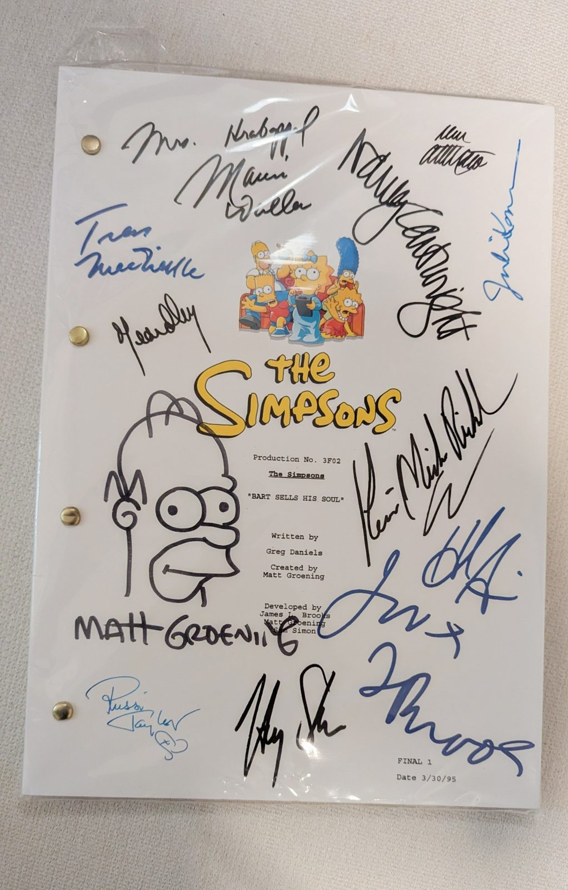
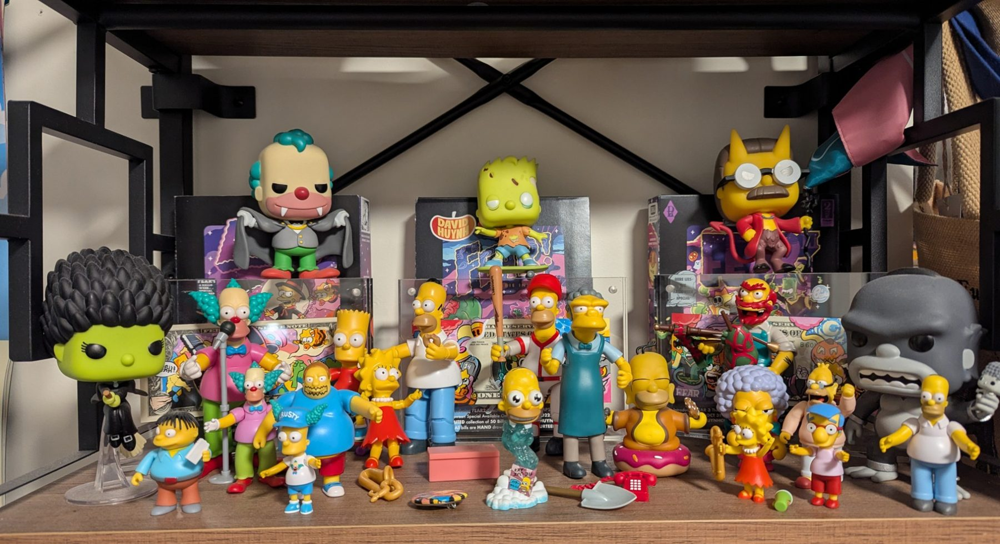
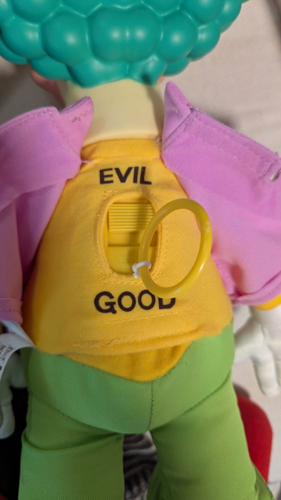

**The short answer:** in "Bart Sells His Soul," Bart signs his soul over to Milhouse for five dollars, and nothing dramatic happens. Small things just stop working. Automatic doors don't open for him. His breath doesn't fog the glass. He can't laugh at cartoons. Websites can lose their soul the same way: they still load, the buttons still work, and something small is quietly missing in every corner. That episode, plus a few *Treehouse of Horror* stories, taught me more about building things than I expected a cartoon to.

## A signed script

"Bart Sells His Soul" is one of my favorite episodes of anything, ever. I like it enough that I own a signed reprint of the script: production number 3F02, written by Greg Daniels, marked "Final 1" and dated March 30, 1995. Matt Groening signed the cover and drew a Homer next to his name, and it's covered in signatures from the people who made the show.

{width=520}

It's a strange thing to treasure, a stack of pages from a cartoon. But it's one of the funniest episodes the show ever made, and underneath all the jokes there's a real, sweet message. Every time I look at the script I think about how much is in those pages that never says itself out loud.

The setup, if you haven't seen it (it's season 7, 1995): Bart insists souls aren't real, and to prove it he writes "Bart Simpson's Soul" on a piece of paper and sells it to Milhouse for five bucks. Lisa is horrified. Bart is five dollars richer.

Then the episode does something really smart. It never shows a devil or a lightning bolt. Bart just slowly notices he's a little less *there*.

- The automatic doors at the Kwik-E-Mart don't open for him.
- He breathes on a window and nothing fogs up.
- The pets don't like him anymore.
- He watches *Itchy & Scratchy* and can't laugh.

By the end he's desperate. He goes looking for the paper, finds out it's been traded away, and ends up alone in his room at night, praying to get his soul back.

(On my Simpsons shelf, Milhouse, Comic Book Guy and Moe in his apron are all standing together. That's basically everyone who had a hand on Bart's soul or a bad idea that week. I didn't plan it that way. I'm choosing to believe it means something.)

## Lisa bought it back

And then the part that gets me every time. Lisa walks in with the piece of paper. She bought it back herself.

Think about everything that goes into that. She was right from the start, and Bart made fun of her for it. She could have let him learn the hard way, or held it over him, or at least said "I told you so" a few more times. Instead she went and got it, with her own money, for a brother who didn't even believe the thing was real. She didn't wait for him to understand why it mattered. She knew it mattered, so she kept it safe until he did.

And Bart, being Bart, takes the paper that says "Bart Simpson's Soul" and eats it. Nobody is getting that one again.

It's the funniest beat in the episode and the sweetest one at the same time, which is pretty much the whole show at its best.

I think about Lisa a lot in my work. Somewhere in every project, there's a small thing that only seems important to one person in the room: the founder's odd origin story, the hand-drawn mark the team almost replaced with a font, a line of copy that sounds like an actual human. In the rush to launch, it's easy to trade those away for something safer. Part of my job, I think, is to be a bit like Lisa: to notice the soul of a project before anyone has to lose it, keep it safe, and hand it back when it matters. Nobody needs a lecture. They just need someone who knew it was important.

## Soul lives in the small stuff

What gets me about that episode is that the soul shows up as *tiny* things. Nobody thinks "an automatic door opening for me is proof I'm human." You only notice it when it doesn't happen.

Websites are the same. A site without soul isn't broken. Everything technically works. But:

- The error message says "Error 422" instead of something a person would say.
- Hover a button and nothing happens. Not even a tiny response that says "yes, that's clickable."
- Every page has the same stock photo energy, and none of it sounds like anyone.
- The 404 page is the default one.

None of those would fail a checklist. Together, they're the automatic door that doesn't open. Visitors can't name what's missing, but they feel it the way Bart's dog feels it.

The fix is just as small. On this site, there's a satellite on the homepage that you're not supposed to drag. If you drag it anyway, it tells you not to. Drag it a few more times and it gets more insistent. Nobody needed that. It took a few lines of code. But it's the breath on the glass: proof someone is in there.

## Don't turn the bar into a family restaurant

The B-plot of the same episode is almost as good. Moe decides the money is in family dining, so he turns his dark, grimy tavern into "Uncle Moe's Family Feedbag," complete with a forced-cheerful costume and a menu he clearly hates. He's miserable. The customers can tell. He ends up turning it back into a bar, because that's what it actually was.

I've seen a lot of brands do the Moe. A small, weird, specific business decides it needs to look like a big, bland, "professional" one, because that's what seems to be working for someone else. It doesn't fit. Everyone can tell. (I wrote about chasing trends in [The Alchemist](/observatory/alchemist-design-trends-going-home): usually the treasure was back home the whole time.)

Your soul and your brand might be the same piece of paper. Don't sell either one for five dollars.

## Treehouse of Horror: four more lessons

Every October, *The Simpsons* does *Treehouse of Horror*: three short scary stories, no rules, nothing counts. They're my favorite episodes every year, and half my shelf is proof: zombie Bart, Marge as a witch, King Homer, and a devil who happens to be Ned Flanders.

That Flanders is from another soul story, "The Devil and Homer Simpson." Homer sells his soul to the devil for a single donut, and the devil turns out to be his neighbor. The way out is my favorite twist in the whole show: Marge proves Homer's soul was never his to sell. He'd already promised it to her, years ago, on the back of their wedding photo. Even for a soul, it matters who it really belongs to. (That's a good thing to remember when someone wants your brand to look like somebody else's.)

Some of my favorite ideas about building things came from these episodes.

### Don't touch anything ("Time and Punishment")

Homer breaks the toaster, accidentally turns it into a time machine and ends up in the age of the dinosaurs. He remembers his dad's advice: if you ever travel back in time, don't step on anything. He immediately swats a mosquito. Back in the present, everything has changed.

That's every developer's first big lesson. Change one small thing (one shared style, one function everyone uses) and something three pages away quietly breaks. Homer keeps going back to fix it, and every fix changes something else.

The episode also ends with the most honest line in software. Homer finally lands in a world that's *almost* right, except for one weird detail, and decides it's close enough. We've all shipped that world.

What I do about it now:
- **Every release of this site's code is a numbered version.** If something breaks, going back is changing one number. (The setup is in [Versioned custom code for Webflow](/observatory/webflow-custom-code-github-jsdelivr).)
- **I save a copy of what's live before I change it.** So there's always a way home.
- **I try not to settle for "close enough."** Recently the eyelids in a little animation on this site let light leak through at the corners. It was a tiny thing. I fixed it anyway, because tiny things are where the soul lives (see above).

### Going 3D ("Homer³")

In one story, Homer slips behind a bookcase into the third dimension. Suddenly he's a computer-generated 3D character in a glowing grid world, and he's completely baffled by it. In 1995 that segment was the first time the show used real 3D animation, and it still looks amazing.

It's also a pretty good picture of what 3D on the web is like. It's exciting, it's beautiful and it's very easy to get lost in. The world eventually starts collapsing into a black hole, which is honestly what happens to a phone when you load a heavy 3D scene on it.

This site is full of 3D: planets you can spin, a wormhole, a black hole in the footer. The rule I learned is that 3D has to earn its place and has to be light enough not to swallow the page. (That's the whole subject of [Interactive 3D in Webflow that doesn't wreck your mobile score](/observatory/interactive-3d-webflow-performance).)

### Check the switch on the back ("Clown Without Pity")

Homer buys Bart a talking Krusty doll for his birthday, and it tries to kill him. Over and over. Homer goes all the way to the guy who designed it, and the fix turns out to be embarrassing: there's a switch on the back of the doll, set to "Evil." Flip it to "Good." Done.

I have that doll, by the way. Here's the back of mine:

{width=420}

Yes, it's set to Evil. I'm leaving it that way. It's a reminder.

I think about that doll every time I fix a bug. So many of the scariest problems end up being one switch. On this site, some little drifting particles on the bookshelf on the About page didn't move at all for a while. I looked at the drawing code, the timing, the browser. The real problem was one line that reset the clock every single frame, so as far as the animation knew, time never passed. One switch on the back.

Now, before I take anything apart, I check the obvious settings first.

### Not every scary thing needs a reason

The last lesson is the whole format. *Treehouse of Horror* doesn't explain itself. The aliens are just there. Nobody asks why. And people love it, and wait for it every year.

A website can have a little of that too. Not on the main path (navigation, contact and the work should always be clear), but in the corners. This site has twenty hidden side quests: a wormhole, a boss fight, a white rabbit. None of them explain themselves. That's half the fun. (More on why hidden things work in [The first easter egg](/observatory/warren-robinett-easter-eggs-hidden-details).)

## In practice

- **Look for the doors that don't open.** Error messages, empty states, hover states, the 404 page. That's where a site's soul is, or isn't.
- **Be the Lisa.** Notice what makes a project feel human and keep it safe, even before anyone asks you to.
- **Be Moe's, not Uncle Moe's Family Feedbag.** Build the site for the business you actually are.
- **Expect butterflies.** Every shared change can step on a mosquito somewhere else. Test the pages you didn't touch.
- **Keep a way home.** Versioned code and a saved copy of what's live, every time.
- **Make 3D earn its place.** Beautiful isn't enough if it pulls the whole page into a black hole.
- **Check the switch on the back first.** Before you rebuild anything, make sure it isn't just set to "Evil."

When Lisa hands Bart his soul back, she tells him that some philosophers say nobody is born with one: you have to earn it. (Bart is mostly busy eating it.) I think that's true of websites too. Nobody's site comes with a soul. You earn it, one tiny detail at a time. And if you're lucky, there's a Lisa around to make sure you don't trade it away for five bucks.

---

**Review notes**
- "Bart Sells His Soul" (season 7, aired October 1995): Bart writes "Bart Simpson's Soul" on paper and sells it to Milhouse for $5; the automatic doors, the breath that doesn't fog, the pets turning on him and not laughing at *Itchy & Scratchy*; his prayer; Lisa buying it back; the B-plot of Uncle Moe's Family Feedbag and Moe turning it back into a bar; Lisa's closing line that some philosophers believe nobody is born with a soul and you have to earn it. Paraphrased, no direct quotes. ⚠️ Angelino, please check these details against your script (it's the best source in the room).
- Signed script (Angelino's, photo 2026-10-02): production no. 3F02, "Written by Greg Daniels", "FINAL 1", "Date 3/30/95", Matt Groening signature + Homer sketch. Angelino says producers and writers signed; some signatures look like voice cast (one reads "Mrs. Krabappel", Marcia Wallace), so the text says "people who made the show" without naming anyone else.
- Images (Angelino's photos): `images/27-bart-sells-his-soul-script.jpg` (lead image candidate) and `images/27-simpsons-shelf.jpg`. Need uploading as Webflow assets when imported.
- *Treehouse of Horror IV* (1993), "The Devil and Homer Simpson": Homer sells his soul to devil Flanders for a donut; Marge shows he'd already pledged his soul to her on the back of their wedding photo. Paraphrased. Shelf figures named from the photo (zombie Bart, witch Marge, King Homer, devil Flanders, Milhouse, Comic Book Guy, Moe in apron).
- *Treehouse of Horror V* (1994), "Time and Punishment": toaster time machine, his father's "don't step on anything" advice (paraphrased), the swatted mosquito, the near-right ending he accepts. *Treehouse of Horror VI* (1995), "Homer³": Homer enters a 3D world behind a bookcase; the show's first computer-generated segment (made with Pacific Data Images); the 3D world collapses into a black hole. *Treehouse of Horror III* (1992), "Clown Without Pity": the evil Krusty doll and the "Evil/Good" switch on its back. Paraphrased from the episodes; the "Uncle Moe's Family Feedbag" name and the switch labels are the only names used.
- Site facts: satellite drag toasts in `home/00-hero.js` ("It says do not drag." then a second line on the third drag); versioned jsDelivr releases + backups before every push (`backups/`); eyelid light leak fixed in v0.33.36 (2026-10-02); bookshelf motes frozen because `loop()` reset the clock every frame, fixed in v0.33.21 (`about/00-about.js`); 20 side quests (`core/24-quests.js`).
- Links: note 19 (/observatory/alchemist-design-trends-going-home), note 06 (/observatory/webflow-custom-code-github-jsdelivr), note 04 (/observatory/interactive-3d-webflow-performance), note 21 (/observatory/warren-robinett-easter-eggs-hidden-details). No em dashes, US spelling.
- Approved by Angelino 2026-10-02 ("publish them all").
- Evil Krusty doll photo (Angelino's own, 2026-10-02): `images/27-evil-krusty-switch.jpg`, rotated upright; the slider sits on the EVIL side in the photo.
- Update 2026-10-02 at his ask: new section "Lisa bought it back" (she buys it back herself and gives it to him; Bart eats the paper; "a very funny episode with a real endearing message", his words). Bart eating it while Lisa explains the philosophers' line is from the episode's ending; check the exact order against the script if you like.
