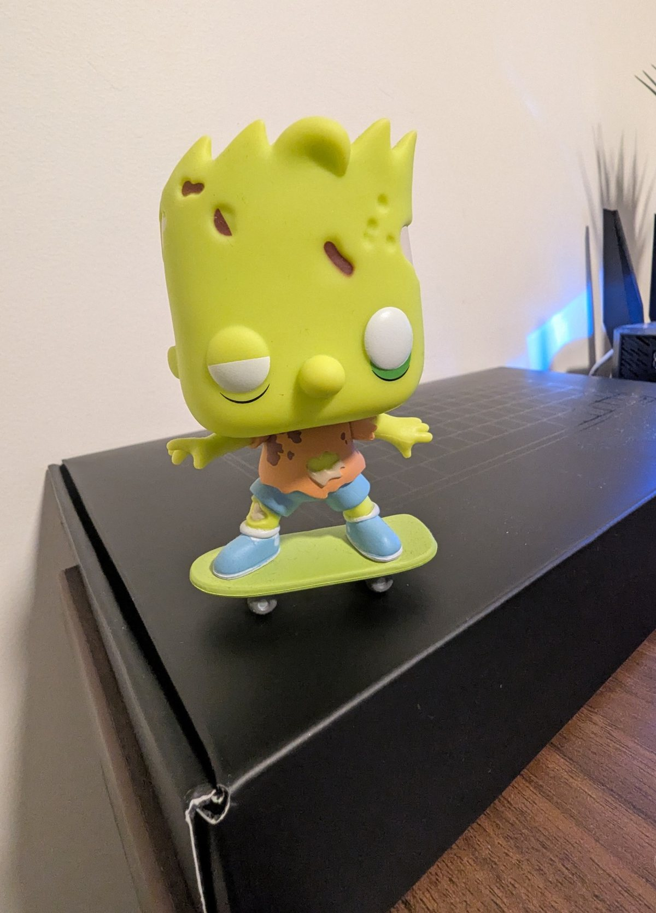
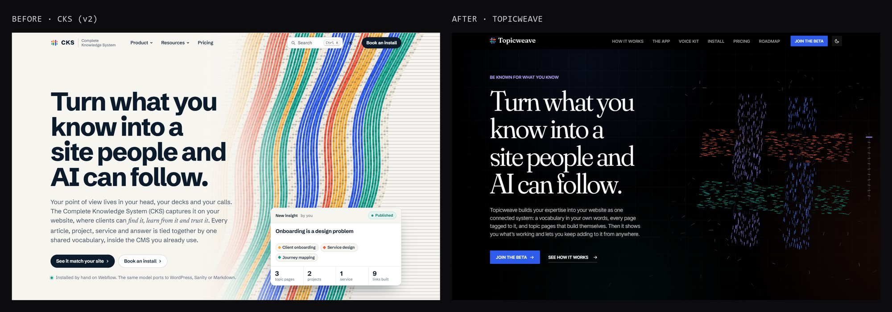
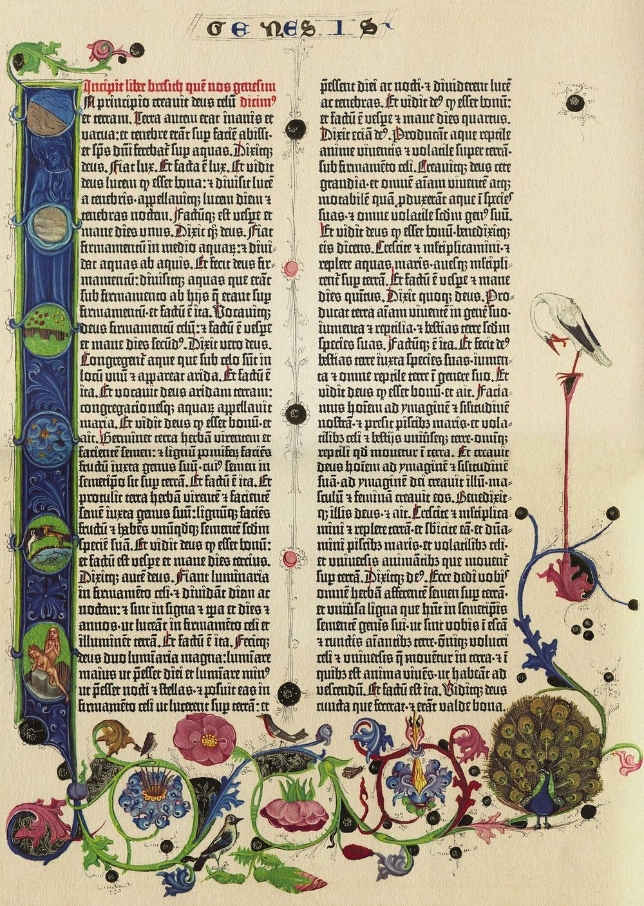
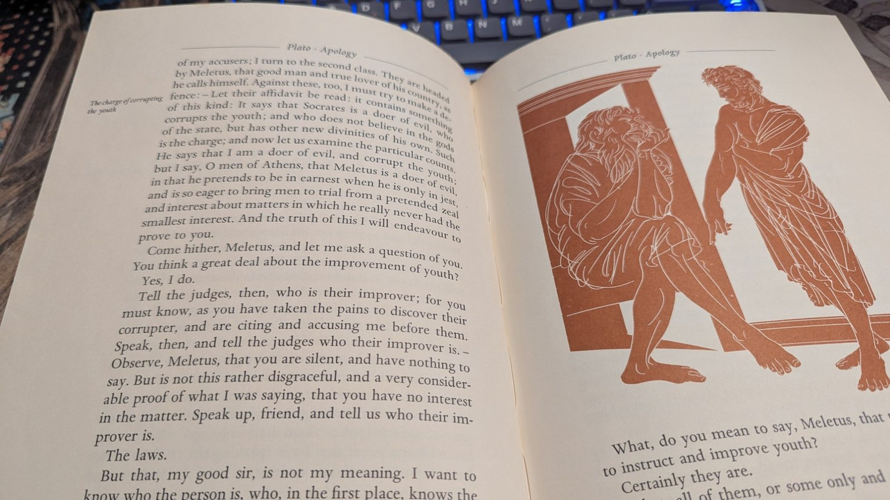
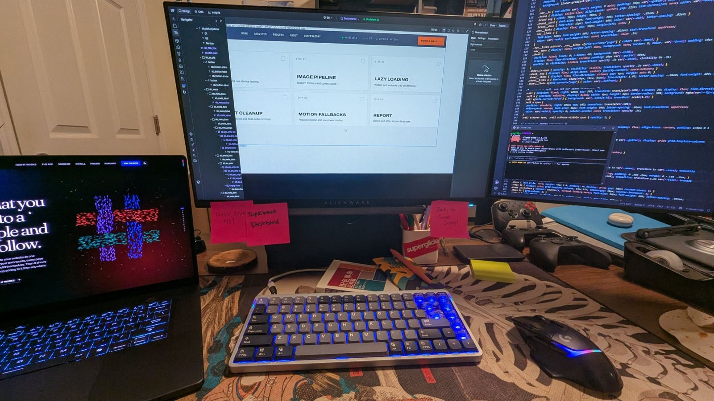
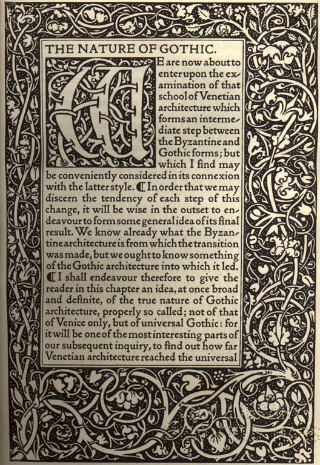

**The short answer:** after World War II, the US built faster than ever, and builders copied modernism's look without the thinking behind it. What was left were buildings that worked and meant nothing: zombie buildings. AI has started a new building boom, and it can fill the web with zombie websites the same way. The way out is old. Have a point of view before you build. Write your standards down where the tools can follow them. Don't confuse *done* with *good*. And leave room for the strange, hand-made detail that shows someone cared. John Ruskin said it about Gothic cathedrals in 1853: you can see the hand of the maker in every column.

## A zombie on my shelf

{width=420}

If you've read [the Simpsons note](/observatory/simpsons-bart-sells-his-soul-web-design), you've seen my shelf. Half of it is *Treehouse of Horror*, and this is one of my favorites: zombie Bart, still on his skateboard. It's the right shape, the right outfit, the right pose. The eyes just say nobody's home. That's great for a cartoon and a terrible quality for a website.

I watched a talk recently by Katie Dill, who leads design at Stripe, called ["How to scale intent, quality, and artistry with AI"](https://www.youtube.com/watch?v=GLvFTMtw4Jk). She has a name for that missing something: *zombie UI*. Interfaces that work, look finished and show no sign that anyone cared about the person using them. Her talk connects to almost everything I've written here, so this note is me following those threads through my own work.

## The building boom

Her story starts after World War II. Soldiers came home, families grew, and the US built faster than it ever had, with new materials and new construction methods. Builders reached for the style of the moment, modernism: simple shapes, bare surfaces, no ornament.

Modernism started with real ideas behind it. I wrote about this in [Less is a bore](/observatory/less-is-a-bore-maximalist-web-design): Mies van der Rohe's "less is more" produced some beautiful buildings, and then a lot of identical glass boxes. The second half is the part that matters here. Under pressure to build fast, the style got copied, then the copies got copied, and each round kept the look and lost a little more of the reason. Banks used to look like banks: stone, columns, a building that said *your money is safe here*. Then banks started to look like dentist's offices, and dentist's offices looked like storage units.

Nobody set out to build a zombie. It's just what happens when the look outlives the thinking. (Baudrillard has a whole theory about this, and it's in [the desert of the real](/observatory/baudrillard-simulacra-template-websites): copies of copies until nobody remembers the original.)

Dill's point is that we're in a building boom again. With AI, a team of three can make what used to take thirty, and one person can make a website before lunch. That's exciting. It also has the same warning signs as the last boom.

## Three warning signs

**The most likely answer.** A language model is built to give you the most probable next thing, which in practice means what's popular or what has worked before. I wrote about this in [AI is a brush, not a hand](/observatory/ai-creative-tool-taste): ask for a landing page and you get the most landing-page landing page there is. Dill's example is perfect. She showed a website and asked the room to guess what the company sold. Software? No, Korean barbecue. Nothing on the page said *grill*, *smoke* or *come hungry*. It looked like every startup because that's the likely answer.

**The temptation of done.** AI makes things look finished very fast, often too fast. Dill confessed to eating a lot of microwave burritos for lunch. You take a frozen brick out of the freezer, and ninety seconds later you've gone from hungry to fed. It isn't good, but you forgive a lot because it was so quick. A one-sentence prompt that gives you a whole interface with rounded corners and soft shadows works the same way. It looks done. Whether it solves anything is a separate question, and the speed makes that question easy to skip.

**Disposable work.** When something takes an afternoon, it can feel like it doesn't matter. Nobody asks who will maintain it, what happens in a year or whether it fits with everything else. The decisions still count; they just stop feeling like decisions.

## My microwave burrito

I've eaten this burrito. Before [Topicweave](/work/topicweave) had its name, it was a concept project called CKS, short for Complete Knowledge System. The first full version came together fast: eight pages, demos, a pricing section, a little product story. It had everything a product site is supposed to have, and on a quick scroll it looked finished.

Look at the two side by side and the funny part is the headline. It didn't change a word. The idea was right from the start. Everything around it was the likely answer: a light page, a heavy sans-serif headline, a floating product card with little stats, a search bar and a "Book an install" button. It's a clean page. It's also the page a hundred software companies already have. The name said what the product was without saying anything about it, and nothing on it was the kind of detail you'd mention to a friend.

So it went back on the table. It got a real name, Topicweave, picked after checking that nobody else owned it. It got its own visual idea: a loom, threads that weave together as you scroll, because that's literally what the product does with a site's topics. Then came the long part. Roughly forty rounds of changes to the look alone, and after that a QA log that just passed 239 notes: a cloth that knits across the screen when you change pages, clouds and birds that keep their shape as you scroll, a phone menu that morphs into an ✕, frame-rate fixes for laptops that cap pages at 30 frames a second.

Nobody will ever count those notes. They'll just feel that the site is *one thing*, made on purpose. That's the difference between done and good, and the first version had only gotten to done.

## Have a point of view

Dill's first recommendation is the one everything else hangs on: **have a point of view, or AI will give you one.** And the one it gives you will be the average, pointed at the past.

At Stripe, she said, the point of view is optimism, and it runs through everything: the colors, the writing, what they choose to write about, the products they ship for people starting businesses. When dozens of people (and now dozens of tools) all touch the same product, a shared point of view is what keeps it from turning into a committee.

Mine is **curiosity**. I didn't set out to choose a word; I found it by looking at what I'd built. A wormhole you can fall into. A white rabbit that hops across a terminal if you wait long enough. Books you can knock off a shelf. A badge you can flip and scan. Twenty side quests for the people who poke at things ([Follow the white rabbit](/observatory/follow-the-white-rabbit-curiosity-design) is the long version). Curiosity is the test every new idea has to pass: *does this reward someone for looking closer?* If not, it doesn't go in, however nice it looks.

There's a story from Dill's talk I keep thinking about. Her team was reviewing an ad made with AI, and someone on the team asked a fair question: what's the quality bar for something made with AI? Her answer was that the question doesn't make sense. Users don't care how something was made. They care whether it's good. The bar is the bar. The team left that meeting with seventeen small fixes (softer edges here, smaller bubbles there), and the office now uses a word from that ad, "Pepsi bubbling," as a verb for meticulous craft. The aim isn't perfection, she said. It's going one level deeper than the customer will ever consciously notice, because they'll feel it anyway. (That's the [Halo note](/observatory/halo-30-seconds-of-fun-interaction-loop) in one sentence: polish the small loop until it feels good every time.)

## Gutenberg's 290 letters

The second recommendation is the one I'd never thought about in these terms: **write your standards down where the machine can read them.**

Everyone knows Gutenberg built the printing press. Fewer people know about the system he built around it. He didn't cut 26 lowercase and 26 capital letters. For his Bible he cut around 290 different characters: letters in several widths, joined pairs called ligatures, abbreviations. That was so every line could be fully justified without the ugly gaps and rivers of white space that machine-set text usually had. He built a system opinionated enough that a machine could make a page that looked as good as a scribe's.

{width=520}

Look at those columns. Every line ends in exactly the same place, and you can't see the trick. (The flowers and birds were painted in by hand after printing, which is its own little lesson: the machine did the type, and people did the part that made each copy one of a kind.)

Almost 600 years later, the copy of Plato's *Apology* on my desk still follows his rules: even columns, a running head, a note in the margin. (The *Apology* is where Socrates says the unexamined life isn't worth living, which is close to my whole reason for writing [why before how](/observatory/why-before-how-philosophy-web-design).) A good system outlives the person who made it, because the intent is built into it.

Dill's line for this stuck with me: the old design systems scaled *consistency*, and the new ones have to scale *intent*. In the past you didn't have to write everything down, because a designer was always in the room to fill in the gaps. Now pages get built with no designer in the room, and sometimes with no person at all. So at Stripe, a design system that only listed buttons and colors wasn't enough. Three people would type the same request and get three different results. What worked was a system that knows full templates and flows, how the product is *supposed* to behave, and that the tools have to follow.

This is where my version of that happens. Topicweave on the laptop, the site open in Webflow, code on the right, and the most honest part of the system: sticky notes. "Death to scope creep!" has been up there a while ([Nietzsche has thoughts on that](/observatory/nietzsche-three-metamorphoses-scope-creep)).

I've seen a small version of Gutenberg's idea on my own site. It's one person, but it's a lot of sessions, and some of the building happens with AI helping. The site works because the rules are written down: a handoff doc that says what's live and why, a build that refuses code older browsers can't run, a log of every bug with the reason behind it. Some of those rules are tiny and hard-won. One says never put a CSS filter on the wormhole, because it makes the browser redraw the layers and flash black for a frame or two. I learned that one the hard way (more on that below). Now it's written down, so nobody, me included, has to learn it twice.

That's the same idea as the keel in [the Ship of Theseus](/observatory/ship-of-theseus-brand-redesign): put the rules in the system, and changing a plank can't change the ship.

## Done is not good

But Dill adds a warning, borrowing from the architect Christopher Alexander: a system can satisfy every rule and still be dead. Rules get you to the floor. They don't get you to anything anyone loves.

Her third recommendation is about that gap: **refuse to confuse done with good.** It used to be that filtering happened naturally, at every step. You had twenty ideas and could staff one, so you argued, pruned and tested, and things grew slowly. Now you can build all twenty in a week. That's great for trying things for real instead of debating them in meetings. But the filtering hasn't gone away; it's moved to *after* the build, when the thing already exists and it's much harder to say no.

So someone has to be the editor. Someone has to use the thing like a user would and ask: does it actually solve the problem? Does it hang together, or does each piece look good alone and feel disconnected once you go through the whole journey? And when it isn't good, the answer isn't always to cut it. Sometimes it's *this isn't finished yet*.

Dill's example: her team made the opening animation for the event where she gave the talk. They built a 3D scene and used AI to help animate it. The first version was fine. It moved and it was fun to watch, but frame by frame it felt slightly jerky and off. So they did it again. Fifty-six versions later it had weight, a little life, details you'd never name but can feel. And she made a fair point: without AI they might never have tried such a complex scene or so many camera angles. AI opened up what was possible. Getting it good still took the fifty-six.

## My fifty-six

I have three of these, and each one taught me something different.

**The wormhole.** On the homepage there's a planet that's actually a wormhole. Click it and you fall in and come out on a random page. The first version of the fall worked fine. Then I kept seeing something: a tiny redraw, a flicker as the ball handed off to the tunnel. It was there for a moment and easy to miss. The next version drew the tunnel at a higher resolution. Still there. The next made the tunnel an exact copy of the ball, matching its angle and size frame by frame so the switch would be seamless. Still there. In the end the fix wasn't a better tunnel; it was no tunnel. The ball pulls in, swells and fades while the starfield warps around the hole. The flicker turned out to be that CSS filter, the one now written in the rules. Four versions to remove a flash most people would never consciously see.

**The blink.** Pick the blue pill in the white rabbit side quest and you "wake up": eyelids blink open on the page. The first eyelids were two black panels with rounded edges, one from the top and one from the bottom. Where their curves met at the corners, light leaked through, a thin bright sliver like a gap under a door. Real eyelids don't leak. The fix was to throw out the two-panel idea and use one black layer with an almond-shaped opening that grows, plus two blurs that clear as the "eyes" focus. Same idea, completely different build, because the first one had a crack in it.

**The clasp.** On my About page there's a crew badge on a lanyard that you can drag, swing and flip. I added a metal clasp where the strap meets the badge. Then I swung it, and the clasp came off the strap. Fixed that, swung it harder, and it broke free again, because the badge lags behind the strap as it swings. Then the browser started drawing the tilted badge *over* the clasp. In the end the clasp moved out of the badge entirely and gets placed every frame at the exact end of the strap, at the strap's angle. Three versions for a piece of metal the size of a fingernail.

None of these were in a brief. No client would have sent them back. But each was the editor's question asked one more time: is it done, or is it good?

## The hand of the maker

Dill ended where I want to end, with John Ruskin. In 1853, in a chapter of *The Stones of Venice* called "The Nature of Gothic," Ruskin argued that what made Gothic cathedrals great wasn't their perfection; it was the opposite. No two were alike. Walk along the columns and the carvings change: a leaf here, a face there, each one showing the hand and mind of the person who carved it. Ruskin thought a builder who demanded perfect, identical work turned the carver into a machine, and you could see that in the stone. "No architecture can be truly noble which is not imperfect," he wrote.

That idea traveled. Forty years later, the designer William Morris printed "The Nature of Gothic" on his own hand press and called it one of the most important things the century had produced. A printer, honoring a book about hand-made things, on a press descended from Gutenberg's. The machine and the hand were never really opposites. The question was always whose judgment was in the work.

{width=420}

This is why the details on this site are the way they are. Each project page has its own planet. The 510 Visuals planet is the dotted globe from that site, and Topicweave's is made of its own threads; they're drawn from each project's real visuals, not picked from a random pool. Hidden things reward people who look closer, which is the same reason Warren Robinett hid his name in a secret room in 1979 ([the first easter egg](/observatory/warren-robinett-easter-eggs-hidden-details)). He wanted proof that a person made it. Soul lives in small things, and you notice when it's missing ([Bart learned that one the hard way](/observatory/simpsons-bart-sells-his-soul-web-design)).

Dill made a point here I love: people aren't impressed that you made something in Three.js in thirty minutes. They're impressed when you solved their problem, and when a small touch shows you saw their need coming.

## Protect the strange

Her last recommendation is her favorite, and mine too: **use AI to make new things, not just old things faster.** Chat boxes, charts and command lines aren't the best interfaces we'll ever have. The best practices for what comes next haven't been written yet. Multi-touch made whole new interactions possible; the synthesizer made new sounds. This is that kind of moment.

Two of her tactics are worth stealing. **Improve your inputs:** don't ask for "a website for my Korean barbecue." Say what you believe, what good looks like to you and what you care about, and bring your own source material. **Stress your outputs:** don't settle for the burrito, push one step past the first answer, and have something (or someone) critique it hard.

But she said the hard part isn't tactics. It's culture. Copying the pattern is safe and comfortable. Finding something that's actually better than the usual is harder and more impressive. If you lead a team, she said, don't just tell people to use AI; give them room to explore. Her phrase for it is the one I'll keep: *protect the strange*. AI makes it cheaper to build. Spend some of what you save on making something special.

This site is my attempt at that. It's loud on purpose, and some designers flinch at it ([why that happens](/observatory/designers-hardest-audience-maximalist-website)). Sometimes the strange idea is the one that makes people remember you.

## In practice

- **Pick your word before you build.** Optimism, curiosity, calm, whatever's true. Test every idea against it.
- **Write the rules down where the tools can see them.** Not just colors and buttons: how things should behave, and the lessons you've already paid for.
- **Treat "it works" as the halfway point.** Use it like a stranger would, end to end, before you call it finished.
- **Name an editor.** Someone has to look at the whole and say "not yet."
- **Go one level deeper than anyone will notice.** They'll feel it.
- **Give your inputs a point of view, and put your outputs under pressure.** The first answer is the likely answer.
- **Protect the strange.** Spend some of what AI saves you on the detail nobody asked for.

*Images: the Gutenberg Bible page (Genesis, facsimile) and the Kelmscott Press page are public domain, via Wikimedia Commons. The other photos are mine.*

---

**Review notes**
- Source talk: Katie Dill (head of design, Stripe), "How to scale intent, quality, and artistry with AI," YouTube https://www.youtube.com/watch?v=GLvFTMtw4Jk (fetched 2026-10-04, ~22 min; transcript read in full). All talk material is paraphrased: post-war boom, Korean barbecue site, microwave burrito, disposable work, Stripe optimism, the AI-quality crit + 17 fixes + "Pepsi bubbling," Gutenberg, consistency → intent, MCP → CLI with templates/flows, the 56-iteration opening animation, "protect the strange," inputs/outputs, the Three.js line, Ruskin close. Event name not stated in the transcript, so the note says "the event where she gave the talk."
- Christopher Alexander line ("a system can satisfy every rule and still be dead") is as quoted in the talk; it reads like a paraphrase of Alexander, so the text attributes it as "borrowing from" him rather than a direct quote. Nabeel Qureshi's essay (cited in the talk) is left out to keep sources lean.
- Gutenberg: the 42-line Bible's type is usually described as about 290 characters (letters in several widths, ligatures, abbreviations) for even justification. General history; "around 290" on purpose.
- Ruskin: "The Nature of Gothic," *The Stones of Venice* vol. II (1853). The talk says 1850; 1853 is the publication date. Quote "no architecture can be truly noble which is not imperfect" is Ruskin, public domain. William Morris's Kelmscott Press edition (1892) and his preface praising it: general history.
- Mies / "less is more" and the glass boxes: links back to note 16, not re-sourced.
- CKS → Topicweave: CKS v2 was 8 pages (case-study-sites/cks-src); rename to Topicweave 2026-10-01 after a USPTO check; ~40 rounds of look feedback (A1–A90) and QA notes B1–B239 in cks-v3/docs/qa-log.md; loom/cloth/birds/phone menu/30 fps fixes from cks-v3/docs/handoff.md. Angelino picked CKS as his "burrito" (2026-10-04). The side-by-side shows the v2 headline survived word for word into Topicweave; the text says so. The "likely answer" / "a hundred software companies" framing of the v2 look: confirmed by Angelino (2026-10-05).
- Iteration stories (Angelino: "all of those," 2026-10-04): wormhole fall v0.33.12 → .15 (tunnel, hi-res tunnel, exact-copy handoff, then replaced; CSS filter on `.wh-ball` caused the black flash); eyelids v0.33.36 (two rounded panels leaked light → one masked radial-gradient layer + two backdrop blurs); badge clasp v0.33.23 → .25. All from docs/handoff.md.
- AI's role on this site, said very lightly per Angelino (2026-10-04): "some of the building happens with AI helping." Matches note 23's framing (no claim about who wrote the code).
- Point of view "curiosity": Angelino's word (2026-10-04). Twenty side quests = current count (core/24-quests.js).
- Images (in `images/`, EXIF/GPS stripped, ≤1600px): `32-zombie-bart.jpg`, `32-plato-apology-book.jpg`, `32-desk.jpg` (Angelino's photos, 2026-10-05); `32-cks-to-topicweave.jpg` (Playwright 1440×900 screenshots of local cks/index.html and cks-v3/index.html, dark theme, 2026-10-05); `32-gutenberg-genesis.jpg` (Public domain, https://commons.wikimedia.org/wiki/File:Gutenberg_Bible_B42_Genesis.JPG, facsimile scan by Jossi); `32-kelmscott-nature-of-gothic.jpg` (Public domain, https://commons.wikimedia.org/wiki/File:Kelmscott_Press_-_The_Nature_of_Gothic_by_John_Ruskin_(first_page).jpg, Springfield MA library system). Adobe pair skipped (Angelino, 2026-10-05). Add each to `assets.json` after the CMS upload.
- Desk photo shows a Claude Code window on the right monitor (small, unreadable at web size): fits the "very lightly" AI framing; Angelino OK'd it (2026-10-05). Sticky notes read "Matrix Easter egg?", "Topicweave Dashboard", "Death to scope creep!".
- Plato's *Apology*: "the unexamined life is not worth living" (38a), paraphrased. Gutenberg Bible c. 1455 → "almost 600 years."
- Links: note 27, 16, 26, 23, 24, 31, 12, 21, 18, 08, 10; mission /work/topicweave. Next free Observatory: WB-23, sort 320, draft 32.
- Length: ~3,340 body words (≈14 min), 6 images. Deep tier.
